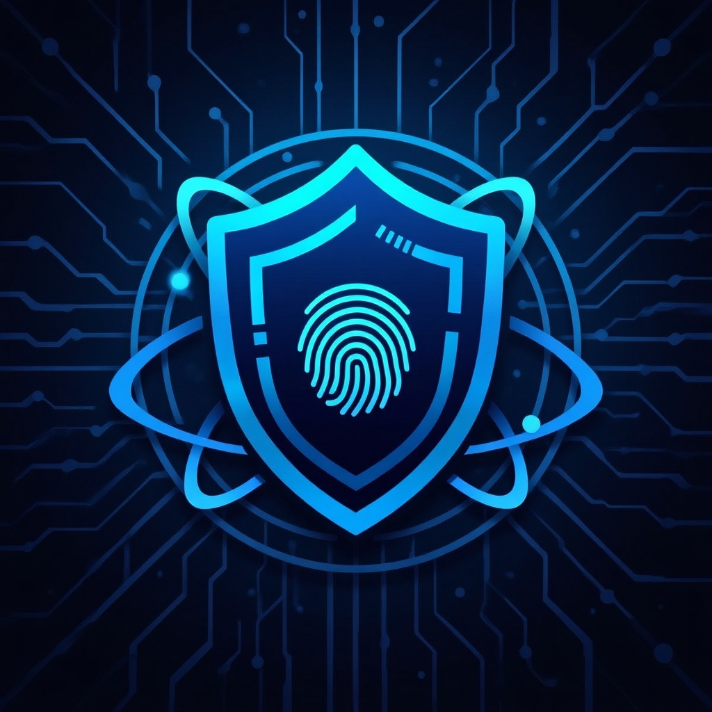

# 🛡️ CipherGuard - Mobil Kriptografik Yerel Şifre Yöneticisi



**CipherGuard**, kullanıcıların hassas şifrelerini ve hesap bilgilerini sadece kendi cihazlarında, askeri düzeyde kriptografik yöntemlerle koruyan, çevrimdışı öncelikli (offline-first) bir mobil güvenlik uygulamasıdır.

Bu uygulamanın temel vizyonu, hiçbir üçüncü parti bulut servisine veya merkezi veritabanına güvenmeye gerek kalmadan şifre güvenliğini sağlamaktır. Verileriniz oluşturduğunuz veya aktardığınız andan itibaren cihazınızda şifrelenir ve şifresi sadece belirlediğiniz "Ana Şifre (Master Password)" ile cihaz içinde çözülür.

## 🎯 Projenin Amacı ve Çözdüğü Sorunlar

Günümüzde siber güvenlik ihlalleri ve veri sızıntıları her geçen gün artmaktadır. Geleneksel çevrimiçi şifre yöneticileri tüm şifreleri kendi merkezi sunucularında tutar; bu da sunucuların hacklenmesi durumunda verilerin tehlikeye girebileceği anlamına gelir. 

**Nasıl Çözüyoruz?**
- **Tam Kontrol:** Kullanıcı, verisinin tek ve gerçek sahibidir. Hiçbir veri dışarıya düz metin olarak çıkmaz.
- **Yerel Öncelik:** Tüm veritabanı lokalde barındırılır. 
- **Sıfır Bilgi Mimarisi:** Geliştiricilerin bile sizin ana şifrenize yahut şifrelenmiş verilerinize erişimi yoktur.  

## ⚙️ Nasıl Çalışır? (Güvenlik Mimarisi)

Uygulamanın güvenlik döngüsü şu şekilde tasarlanmıştır:
1. **Ana Şifre Oluşturma:** Uygulamayı ilk kurduğunuzda sizden bir Master Password (Ana Şifre) istenir. Bu şifre sistemde açık halde tutulmaz.
2. **Kriptografik İşlemler (AES-256):** 
   - Ana şifreniz arka planda `SHA-256` ile hash'lenerek güvenceye alınır ve yüksek güvenlikli 256-bit AES anahtarına dönüştürülür.
   - Tüm şifreler veritabanına (`SQLite`) yazılmadan hemen önce `AES-256 (CBC Modu, PKCS7 Padding, rastgele IV)` algoritmasıyla şifrelenir.
3. **Biyometrik Kimlik Doğrulama:** Günlük kullanım kolaylığı için cihazın yerel yüz tanıma veya parmak izi sensörleri kullanılarak ana şifrenin her girişte girilme zorunluluğu ortadan kaldırılır.
4. **Google Drive Yedeklemesi:** Cihaz kayıplarına karşı kullanıcılar isterse kendi Google hesaplarıyla yedekleme yapabilir. Sistem yedekleme esnasında verileri düz metin yüklemez; doğrudan sizin şifrelediğiniz `cipherguard_backup.enc` adlı AES-256 şifreli dosyayı kullanıcıya bile görünmez olan Google Drive gizli birimine (`appDataFolder`) kaydeder.

## 🚀 Öne Çıkan Özellikler

- **🔒 Üst Düzey Şifreleme**: AES-256 algoritmasıyla sadece size özel şifreleme.
- **📂 Yerel Depolama (Offline First)**: Bilgiler internete çıkmadan sadece telefonunuzda barınır.
- **☁️ Güvenli Bulut Yedekleme**: Google Drive'ın gizli uygulama klasörü (`appDataFolder`) kullanılarak, uçtan uca şifreli bulut senkronizasyonu.
- **👆 Biyometrik Giriş Desteği (Local Auth)**: TouchID ve FaceID destekli giriş mekanizması.
- **🏷️ Kategorizasyon Sistemi**: Arayüzde şifreleri filtreleme kolaylığı (Sosyal Medya, İş, Kişisel ve Diğer).
- **🌍 Çoklu Dil Desteği (Localization)**: Birden fazla dilde kullanım imkanı.
- **🎨 Animasyonlu Modern UI**: Eğlenceli geçişler, edge swipe mekanizmaları ve Borealis animasyonlu arka planları ile üstün kullanıcı deneyimi.

## 💻 Kullanılan Teknolojiler ve Entegrasyonlar

Uygulama modern Flutter mimarisiyle, en hızlı ve güvenli kütüphaneler kullanılarak inşa edilmiştir:

* **Çatı & Dil:** Flutter, Dart 3.x
* **Veritabanı:** `sqflite` (İlişkisel lokal veri depolama)
* **Kriptografi Standartları:** 
  * `encrypt` (AES-256, CBC Modu için)
  * `crypto` (Güvenli Hashlemeler ve SHA-256 için)
* **Biyometrik Güvenlik:** `local_auth` (Kusursuz cihaz güvenliği entegrasyonu)
* **Bulut & Yetkilendirme (Google):** 
  * `google_sign_in` (Google hesaplarına güvenli OAuth 2.0 girişi)
  * `googleapis` (Sürüş/Yedekleme API entegrasyonu)
* **Tasarım:** `google_fonts`, Material 3 Tasarım Prensipleri, Edge Swipe paketleri ve özel UI widgetleri.

## 🛠️ Başlangıç ve Kurulum

Projeyi klonladıktan sonra çalıştırabilmek ve bağımlılıkları çözmek için aşağıdaki adımları takip edebilirsiniz:

```bash
# 1. Projeyi bilgisayarınıza indirin
git clone https://github.com/Semai-Mirac/Kriptografik-Yerel-Sifre-Yoneticisi-Mobile-Security-.git

# 2. Proje dizinine geçiş yapın
cd Kriptografik-Yerel-Sifre-Yoneticisi-Mobile-Security-

# 3. Flutter paketlerini yükleyin
flutter pub get

# 4. Projeyi çalıştırın
flutter run
```
